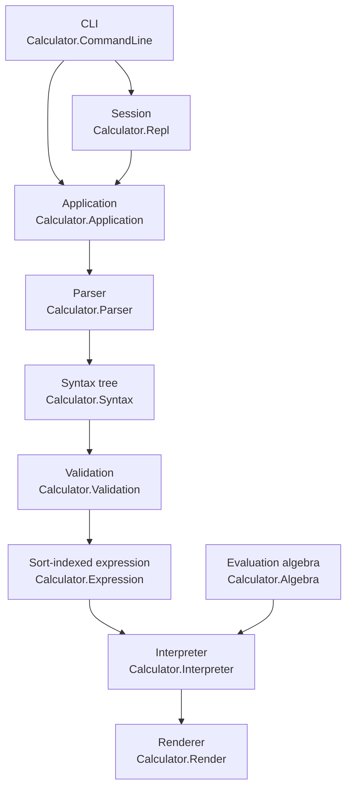

# calculator

Calculator is a command-line application for performing basic arithmetic.

```
$ calculator "2 + 2"
4
```

## Overview

Calculator reads an arithmetic expression, evaluates it exactly and prints the result. It supports addition, subtraction, multiplication, division, exponentiation, unary negation and parentheses over integer and decimal literals. Arithmetic is performed on exact rationals, so `0.1 + 0.2` prints `0.3`.

Each expression is treated as a program in a small typed language. Source text is parsed into a syntax tree, the tree is elaborated into an expression indexed by its number sort, the expression is interpreted in the algebraic structure of that sort, and the value is rendered. Every stage is a pure function. The only module that performs IO is `Calculator.CommandLine`.

## Architecture



| Module | Contents |
|---|---|
| `Calculator.Algebra` | `Semiring`, `Ring` and `Field` classes, instances for `Natural`, `Integer` and `Rational`, and `NonZero` divisors |
| `Calculator.Number` | The sorts ℕ, ℤ and ℚ, their carrier types, the embeddings between them, and binary height |
| `Calculator.Syntax` | Surface syntax, numerals, operators and the fixity table |
| `Calculator.Parser` | Precedence-climbing parser built on Megaparsec |
| `Calculator.Printer` | Prints syntax with the parentheses the grammar requires and no others |
| `Calculator.Expression` | `Expr s`, a GADT indexed by sort, and `Program`, a closed expression paired with its sort |
| `Calculator.Validation` | Sort inference and elaboration from `Syntax` to `Program` |
| `Calculator.Interpreter` | Interpretation of `Expr s` into `Carrier s` |
| `Calculator.Render` | Decimal and fraction notation |
| `Calculator.Application` | `calculate`, `valueOf`, `judge`, and the error type that composes the stages |
| `Calculator.Diagnostic` | Error messages and caret placement |
| `Calculator.Repl` | The session state machine and a loop over an abstract terminal |
| `Calculator.CommandLine` | Option parsing and the terminal implementation for `IO` |

`app/Main.hs` contains one binding, `main = CommandLine.main`.

The application layer exposes one function per question a caller can ask:

```haskell
calculate :: Configuration -> SourceText -> Either CalculatorError RenderedResult
valueOf   :: MagnitudeBound -> SourceText -> Either CalculatorError Rational
judge     :: SourceText -> Either CalculatorError Judgement
```

## Semantics

### Grammar

```
expression ::= expression ("+" | "-") term | term
term       ::= term ("*" | "/") unary | unary
unary      ::= "-" unary | power
power      ::= atom "^" unary | atom
atom       ::= numeral | "(" expression ")"
numeral    ::= digit+ ("." digit+)?
```

Whitespace may appear between any two tokens. The input must be consumed in full.

Addition, subtraction, multiplication and division associate to the left. Exponentiation associates to the right, so `2 ^ 3 ^ 2` is `2 ^ 9`. Unary minus binds more loosely than exponentiation and may begin an exponent, so `-2 ^ 2` is `-4` and `2 ^ -1` is `0.5`. These are the rules Python uses for `**`.

The operator symbols, their precedences and their associativities are stored in one table in `Calculator.Syntax`. The parser and the printer both read it.

### Sorts

Every expression has a sort: ℕ (natural numbers), ℤ (integers) or ℚ (rationals). The sorts are ordered ℕ ⊂ ℤ ⊂ ℚ, and validation infers the least sort of each subexpression:

| Expression | Sort |
|---|---|
| integer literal | ℕ |
| decimal literal | ℚ |
| `a + b`, `a * b` | the larger of the operand sorts |
| `a - b`, `-a` | the larger of the operand sorts, and at least ℤ |
| `a / b` | ℚ |
| `a ^ n`, `n : ℕ` | the sort of `a` |
| `a ^ n`, `n : ℤ` | ℚ |
| `a ^ n`, `n : ℚ` | rejected |

When operands have different sorts, the smaller one is widened through the embeddings ℕ → ℤ → ℚ. The embeddings are semiring homomorphisms and the direct embedding ℕ → ℚ equals the composite, so the choice of path does not affect the value. The test suite checks both facts.

The sorts exist because of exponentiation. A natural power is repeated multiplication and is defined for every base. An integer power needs a reciprocal, which exists only for nonzero rationals. A rational power is irrational in general and is rejected before evaluation. The rule is syntactic: `2 ^ (4 / 2)` is rejected because `4 / 2` has sort ℚ, though its value is an integer. `:type` in the interactive session prints the sort of an expression.

### Evaluation

ℕ is a commutative semiring, ℤ a commutative ring and ℚ a field. Each constructor of `Expr s` requires the structure its operation needs from the carrier of `s`:

```haskell
Add          :: Semiring (Carrier s) => Expr s -> Expr s -> Expr s
Subtract     :: Ring (Carrier s)     => Expr s -> Expr s -> Expr s
Divide       :: Field (Carrier s)    => Expr s -> Expr s -> Expr s
NaturalPower :: (Semiring (Carrier s), Height (Carrier s)) => Expr s -> Expr 'N -> Expr s
IntegerPower :: (Field (Carrier s), Height (Carrier s))    => Expr s -> Expr 'Z -> Expr s
```

`Natural` has no `Ring` instance, so a subtraction over ℕ cannot be constructed; validation widens both operands to ℤ first. The interpreter maps each constructor to the method of the class it requires.

Division takes a `NonZero` divisor. The only way to obtain one is `nonZero`, which compares its argument with zero, so a zero divisor becomes `DivisionByZero` instead of an exception. `0 ^ -1` is also a division by zero. `0 ^ 0` is 1.

No operation rounds. The one resource limit applies to exponentiation. For a rational p/q in lowest terms, binary height is ⌊log₂ max(|p|, q)⌋, and the height of xⁿ is at least n times the height of x. Before computing a power, the interpreter compares n × height(x) with a bound of 100,000 bits and refuses the power if the product is larger. Since the product never exceeds the true height of the result, a refused power would not have fit. `2 ^ 100000` is computed; `2 ^ 100001` and `9 ^ 9 ^ 9` are refused. The bases 0, 1 and -1 have height 0 and accept any exponent, so `0 ^ 1000000000000` is 0.

### Rendering

Results print in decimal notation. If the decimal expansion terminates within the precision (20 fractional digits by default), it prints in full. Otherwise the expansion is truncated after that many digits and followed by `…`. Every printed digit is a digit of the exact value, and the ellipsis appears exactly when digits were left out.

```
$ calculator "420 / 69"
6.08695652173913043478…
$ calculator --fraction "420 / 69"
140/23
```

### Errors

The three stages that can fail each have an error type, and the application layer combines them:

```haskell
data CalculatorError
  = ParseFailure !SyntaxError
  | ValidationFailure !ValidationError
  | EvaluationFailure !EvaluationError
```

Text is produced only by `Calculator.Diagnostic`, at the boundary:

```
$ calculator "1 + * 2"
1 + * 2
    ^
error: unexpected '*'; expecting '(', '-', or number
$ calculator "2 ^ 0.5"
error: exponent 0.5 is not an integer expression
$ calculator "1 / 0"
error: division by zero
```

In one-shot mode, errors go to standard error and the exit status is 1. In an interactive session they are printed in place of the result.

## Building

Tested with GHC 9.14.1 and cabal-install 3.18.1.0.

```
cabal build
cabal install exe:calculator --installdir="$HOME/.local/bin"
```

`cabal.project` enables the test suite and benchmarks and adds `-Werror` for this package. The warning set is in the `discipline` stanza of `calculator.cabal`.

Formatting and linting:

```
fourmolu --mode check src app test bench
hlint src app test bench
```

## Usage

```
$ calculator "2 + 3 * 4"
14
$ calculator "(2 + 3) * 4"
20
$ calculator "-(10 - 3)"
-7
```

Several arguments are joined with spaces, so `calculator 2 + 2` also works. Quote expressions that contain `*`, `(` or `)` to keep the shell from interpreting them.

| Option | Effect |
|---|---|
| `-p`, `--precision DIGITS` | Print at most `DIGITS` fractional digits (default 20) |
| `-f`, `--fraction` | Print exact fractions such as `140/23` |

Without an expression, calculator starts an interactive session:

```
$ calculator
λ> 2 + 2
4
λ> (21 * 2) + 27
69
λ> 1 / 0
error: division by zero
λ> :type 2 - 3
2 - 3 : ℤ
λ> :quit
```

| Command | Effect |
|---|---|
| `:type EXPRESSION`, `:t` | Print the sort of an expression |
| `:history` | List the expressions evaluated so far |
| `:help`, `:h`, `:?` | List the commands |
| `:quit`, `:q` | End the session; end of input does the same |

When standard input is not a terminal, the prompt is omitted and each line is evaluated in turn:

```
$ printf '1 + 1\n2 * 3\n' | calculator
2
6
```

## Testing

```
cabal test
```

The suite has 193 examples. The properties generate syntax trees, not strings:

- The semiring laws for ℕ, ℤ and ℚ, the ring laws for ℤ and ℚ, and the field laws for ℚ.
- Each embedding preserves addition, multiplication, zero and one, and ℕ → ℚ equals ℤ → ℚ after ℕ → ℤ.
- `binaryHeight (x ^ n) >= n * binaryHeight x`, which is the fact the magnitude bound relies on.
- Printing a tree and parsing the text recovers the tree, and printed text is a fixed point of parsing then printing.
- Inserting redundant parentheses into a program does not change its result.
- For every generated program that passes validation, the result equals that of a separate evaluator in the test suite (`Calculator.Oracle`) that uses `Rational` arithmetic directly and has no sorts. This property runs 1,000 cases.
- Decimal output equals the value truncated to the requested number of digits, and ends in `…` exactly when the two differ. Fraction output parses back to the same rational.

The unit tests cover literals, precedence, associativity, negation, whitespace, twelve malformed inputs with their error offsets, sort inference, division by zero, the magnitude bound, rendering, diagnostics, command parsing and scripted sessions. The scripted sessions run `runRepl` in `State`, the same loop the executable runs in `IO`.

## Benchmarks

```
cabal bench
```

Measured on an Apple M5 with 16 GiB of memory, GHC 9.14.1, default optimisation, `--time-limit 10`. Times are Criterion's ordinary least squares estimate per iteration.

| Benchmark | Input | Time |
|---|---|---|
| `parse/literal` | `3.14159265358979` | 355 ns |
| `parse/nested` | 64 levels of `(k * … - 1)` | 68.3 μs |
| `evaluate/small` | validated `(8 * 4) / 2` | 61.2 ns |
| `evaluate/large` | validated sum of 1,000 terms `k ^ 2 / (k + 1) - 0.5` | 4.90 ms |
| `pipeline/small` | `(8 * 4) / 2`, text to text | 1.51 μs |
| `pipeline/large` | the 1,000-term sum, text to text | 8.22 ms |

The exact value of the 1,000-term sum is a fraction with a 1,457-bit numerator and a 1,438-bit denominator.

## Design

**Exact numbers.** `Double` cannot represent 0.1, and a calculator that prints `0.30000000000000004` for `0.1 + 0.2` is wrong. Every literal is read as an exact rational: `0.050` is stored as the natural number 50 with scale 3. Numeric values are converted to text only in `Calculator.Render`.

**Sorts instead of one number type.** With a single rational type, the interpreter would have to discover non-integral exponents while evaluating, and its result type would need an error for them. Indexing expressions by sort moves that check into validation, and it leaves ℕ without subtraction.

**Constraints on constructors.** The class dictionary each operation needs is stored in the constructor that uses it. Matching on `Add` brings `Semiring (Carrier s)` into scope, so the interpreter has one line per constructor and no case analysis on sorts. Validation discharges the constraints when it builds the tree, where the sort is known.

**Parentheses are syntax.** The parser keeps `Group` nodes. The printer reproduces what was written, error messages quote the offending exponent as typed, and validation discards the groups.

**Totality.** The library calls none of `error`, `undefined`, `head`, `tail`, `fromJust`, `(!!)` or `unsafePerformIO`, and `-Wall` with `-Werror` rejects incomplete pattern matches. The pattern synonym `NonZero` is read-only; its constructor is not exported, so every `NonZero` value came from `nonZero`. Every `Expr` built from the exported constructors is well-sorted, because the sort index enforces it.

**Strictness.** Every field of `Syntax`, `Expr` and `Program` is strict, and the leaves are `Natural`, `Rational` and enumerations, which are strict themselves. Weak head normal form is therefore normal form, and the `NFData` instances for `Expr` and `Program` are `rwhnf`.

**Effects.** `step :: Session -> Text -> Transition` is a pure state machine. `runRepl` drives it through a `Terminal m` record for any monad `m`. `Calculator.CommandLine` supplies the `IO` terminal, which reads bytes and decodes them leniently, so malformed UTF-8 becomes a syntax error.

## License

BSD-2-Clause. See `LICENSE`.
